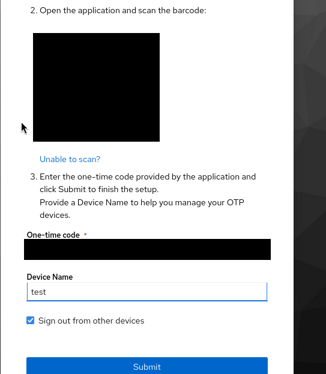

## Enforce TOTP MFA in Keycloak

1. Go to `Authentication` > `Policies` > `OTP Policy`.

2. Set the number of digits to 6, hash algorithm to SHA1, token period to 30 seconds, and type to Time Based. These defaults work with Google Authenticator, Authy, and similar apps.

3. Set a password for the account.

4. Log in.

5. Keycloak prompts to scan the QR code to enroll TOTP.

